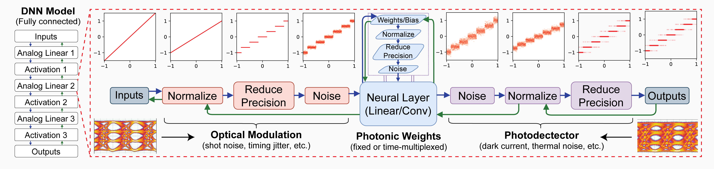

# AnalogVNN

[](https://arxiv.org/abs/2210.10048)
[](https://colab.research.google.com/github/Vivswan/AnalogVNN/blob/v1.0.0/docs/_static/AnalogVNN_Demo.ipynb)

[](https://badge.fury.io/py/analogvnn)
[](https://analogvnn.readthedocs.io/en/stable/?badge=stable)
[](https://badge.fury.io/py/analogvnn)
[](https://opensource.org/licenses/MPL-2.0)

Documentation: [https://analogvnn.readthedocs.io/](https://analogvnn.readthedocs.io/)

## Installation:

- Install [PyTorch](https://pytorch.org/)
- Install AnalogVNN using [pip](https://pypi.org/project/analogvnn/)

```bash
pip install analogvnn
```



## Abstract

**AnalogVNN** is a simulation framework built on PyTorch which can simulate the effects of
optoelectronic noise, limited precision, and signal normalization present in photonic
neural network accelerators. We use this framework to train and optimize linear and
convolutional neural networks with up to 9 layers and ~1.7 million parameters, while
gaining insights into how normalization, activation function, reduced precision, and
noise influence accuracy in analog photonic neural networks. By following the same layer
structure design present in PyTorch, the AnalogVNN framework allows users to convert most
digital neural network models to their analog counterparts with just a few lines of code,
taking full advantage of the open-source optimization, deep learning, and GPU acceleration
libraries available through PyTorch.

AnalogVNN Paper: [https://arxiv.org/abs/2210.10048](https://arxiv.org/abs/2210.10048)

## Citing AnalogVNN

We would appreciate if you cite the following paper in your publications for which you used AnalogVNN:

```bibtex
@article{shah2022analogvnn,
  title={AnalogVNN: A fully modular framework for modeling and optimizing photonic neural networks},
  author={Shah, Vivswan and Youngblood, Nathan},
  journal={arXiv preprint arXiv:2210.10048},
  year={2022}
}
```

Or in textual form:

```text
Vivswan Shah, and Nathan Youngblood. "AnalogVNN: A fully modular framework for modeling 
and optimizing photonic neural networks." *arXiv preprint arXiv:2210.10048 (2022)*.
```