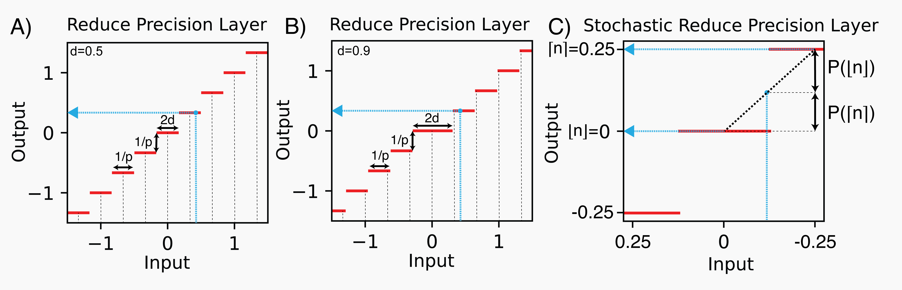
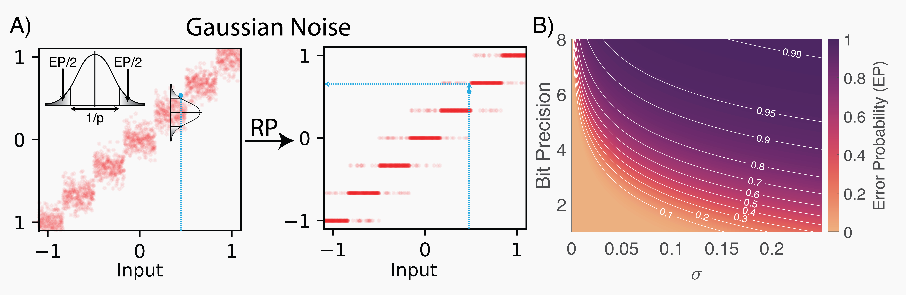

# Extra Analog Classes

Some extra layers which can be found in AnalogVNN are as follows:

## Reduce Precision

Reduce Precision classes are used to reduce precision of an input to some given precision level

### ReducePrecision

class: {py:class}`analogvnn.nn.precision.ReducePrecision.ReducePrecision`

Reduce Precision uses the following function to reduce precision of the input value

```{math}
RP(x) = sign(x * p) * max(\left\lfloor \left| x * p \right| \right\rfloor, \left\lceil \left| x * p \right| - d \right\rceil) * \frac{1}{p}
```

where:

- x is the original number in full precision
- p is the analog precision of the input signal, output signal, or weights (p ∈ Natural Numbers,
  {math}`Bit\;Precision = log_2(p+1)`)
- d is the divide parameter (0 ≤ d ≤ 1, default value = 0.5) which determines whether x is rounded to a discrete level
  higher or lower than the original value

### StochasticReducePrecision

class: {py:class}`analogvnn.nn.precision.StochasticReducePrecision.StochasticReducePrecision`

Reduce Precision uses the following probabilistic function to reduce precision of the input value

```{math}
SRP(x) = sign(x*p) * f(\left| x*p \right|) * \frac{1}{p}

f(x)  = \left\{ \begin{array}{cl}
\left\lfloor x \right\rfloor & : \ r \le 1 - \left| \left\lfloor x \right\rfloor - x \right| \\
\left\lceil x \right\rceil & : otherwise
\end{array} \right.
```

where:

- r is a uniformly distributed random number between 0 and 1
- p is the analog precision (p ∈ Natural Numbers, {math}`Bit\;Precision = log_2(p+1)`)
- f(x) is the stochastic rounding function



## Normalization

### LPNorm

class: {py:class}`analogvnn.nn.normalize.LPNorm.LPNorm`

```{math}
L^pNorm(x) = \left[ {x}_{ij..k} \to \frac{{x}_{ij..k}}{\sqrt[p]{\sum_{j..k}^{} \left| {x}_{ij..k} \right|^p}} \right]

L^pNormM(x) = \frac{L^pNorm(x)}{max(\left| L^pNorm(x) \right|))}
```

where:

- x is the input weight matrix,
- i, j ... k are indexes of the matrix,
- p is a positive integer.

### LPNormW

class: {py:class}`analogvnn.nn.normalize.LPNorm.LPNormW`

```{math}
L^pNormW(x) = \frac{x}{\left\| x \right\|_p} = \frac{x}{\sqrt[p]{\sum_{}^{} \left| x \right|^p}}

L^pNormWM(x) = \frac{L^pNormW(x)}{max(\left| L^pNormW(x) \right|))}
```

where:

- x is the input weight matrix,
- p is a positive integer.

### Clamp

class: {py:class}`analogvnn.nn.normalize.Clamp.Clamp`

```{math}
Clamp_{pq}(x) = \left\{ \begin{array}{cl}
q & : \ q \lt x \\
x & : \ p \le x \le q \\
p & : \ p \gt x
\end{array} \right.
```

where:

- p, q ∈ ℜ (p ≤ q, Default value for photonics p = −1 and q = 1)

## Noise

### Leakage

We have defined an information loss parameter, "Error Probability" or "EP" or "Leakage", as the probability that a
reduced precision digital value (e.g., "1011") will acquire a different digital value (e.g., "1010" or "1100") after
passing through the noise layer (i.e., the probability that the digital values transmitted and detected are different
after passing through the analog channel). This is a similar concept to the bit error ratio (BER) used in digital
communications, but for numbers with multiple bits of resolution. While SNR (signal-to-noise ratio) is inversely
proportional to sigma, the standard deviation of the signal noise, EP is indirectly proportional to σ. However,
we choose EP since it provides a more intuitive understanding of the effect of noise in an analog system from a
digital perspective. It is also similar to the rate parameter used in PyTorch’s Dropout Layer \[23\], though different
in function. EP is defined as follows:

```{math}
leakage = 1 - \frac{\int_{q=a}^{b}\int_{p=-\infty}^{\infty} sign\left( \delta\left( RP\left( p \right) -RP\left( q \right)\right) \right) * PDF_{N_{RP(q)}}(p) \; dp \; dq}{\left| b - a \right|}
```

```{math}
leakage = 1 - \frac{\int_{q=a}^{b}\int_{p=max\left( RP(q) - \frac{s}{2}, a \right)}^{min\left( RP(q) + \frac{s}{2}, b \right)}  PDF_{N_{RP(q)}}(p) \; dp \; dq}{\left| b - a \right|}
```

```{math}
leakage = 1 - \frac{1}{size(R_{RP}(a,b)) - 1} * \sum_{q\in S_{RP}(s,b)}^{}\int_{p=max\left( p - \frac{s}{2}, a \right)}^{min\left( q + \frac{s}{2}, b \right)} PDF_{N_{RP(q)}}(p) \; dp
```

```{math}
leakage = 1 - \frac{1}{size(R_{RP}(a,b)) - 1} * \sum_{q\in S_{RP}(s,b)}^{} \left[ CDF_{N_{q}}(p) \right]_{max\left( p - \frac{s}{2}, a \right)}^{min\left( q + \frac{s}{2}, b \right)}
```

For noise distributions invariant to linear transformations (e.g., Uniform, Normal, Laplace, etc.), the EP equation is
as follows:

```{math}
leakage = 2 * CDF_{N_{0}} \left( - \frac{1}{2 * p} \right)
```

where:

- leakage is in the range \[0, 1\]
- {math}`\delta` is the Dirac Delta function
- RP is the Reduce Precision function (for the above equation, d=0.5)
- s is the step width of reduce precision function
- {math}`R_{RP}(a, b)` is {math}`\{x ∈ [a, b] | RP(x) = x\}`
- {math}`PDF_x` is the probability density function for the noise distribution, x
- {math}`CDF_x` is the cumulative density function for the noise distribution, x
- {math}`N_x` is the noise function around point x. (for Gaussian Noise, x = mean and for Poisson Noise, x = rate)
- a, b are the limits of the analog signal domain (for photonics a = −1 and b = 1)

### GaussianNoise

class: {py:class}`analogvnn.nn.noise.GaussianNoise.GaussianNoise`

```{math}
leakage = 1 - erf \left( \frac{1}{2\sqrt{2} * \sigma * p} \right)

\sigma = \frac{1}{2\sqrt{2} * p * erf^{-1}(1 - leakage)}
```

where:

- {math}`\sigma` is the standard deviation of Gaussian Noise
- leakage is the error probability (0 > leakage > 1)
- erf is the Gauss Error Function
- p is precision


